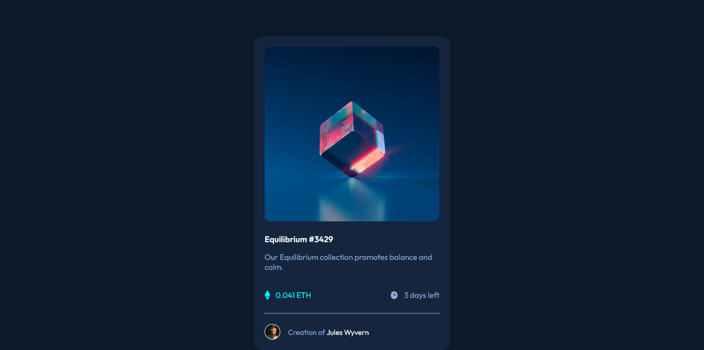

# BLOCKCHAIN UNN - NFT preview card component solution

This is a solution to the NFT preview card component challenge for BUD session 4

## Overview

### The challenge

Users should be able to:

- View the optimal layout depending on their device's screen size

### Screenshot

### Links

- Solution URL: [Add solution URL here](https://your-solution-url.com)
- Live Site URL: [Add live site URL here](https://your-live-site-url.com)

## My process

### Built with

- Semantic HTML5 markup
- CSS custom properties
- Flexbox

### What I learned

I learned the basics of CSS flexbox and its usage on webpage layouts.

I also improved my basic CSS properties such as margin, padding, background properties e.t.c

## Acknowledgments

Thank you BLOCKCHAIN UNN for this opportunity. 
